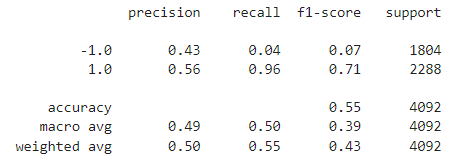

# Machine-Learning-Trading-Bot
In this project, I have created an algorithmic trading bot that learns and adapts to new data and evolving markets with my skills in financial Python programming and machine learning. I also adjusted the input parameters to optimize the trading algorithm, and trained a new machine learning model and compare its performance to that of a baseline model by performing backtesting.
## Evaluation Report

1. Baseline trading algorithm
    
    Firstly, I have establish a baseline performance for the trading algorithm. The perfomance of the trading algorithms are decided based on the accuracy of the trading predictions that each makes and the resulting cumulative strategy returns.

    - Accuracy: The accuracy of the baseline trading algorithm is 0.55. Which is just a little bit better than random guessing. It requires further tuning. We also need to consider the strategy used and the strategy returns to evaluate its overall performance.
    
    - Cummulative Strategy Returns: The cummulative actual returns based on market fluctuation is 1.386976, but the cummulative strategy returns is only 1.517607, which is slightly better than the actual returns.
    
    - Actual Returns vs Strategy Returns: As shown in the plot below, the strategy returns ended up higher than the actual returns based on the market fluctuations.
    

2. Tuned trading algorithm with 6 months training data

    As stated above, the baseline trading algorithm still required further tuning, thus I attempted to improve the performance of the trading algorithm by changing the period for training data from three months to six months. 
    - Accuracy: The accuracy has increased slightly from 0.55 to 0.56 after changing the period for training data from three months to six months. 
    
    - Cummulative Strategy Returns: The cummulative actual returns based on market fluctuation is 1.560429, but the cummulative strategy returns is 1.841664, which is significantly better than the actual returns.
    
    - Actual Returns vs Strategy Returns: As shown in the plot below, the strategy returns ended up way higher than the actual returns based on the market fluctuations.
    
    - Question: What impact resulted from increasing or decreasing the training window?
    - Answer: By increasing the training window from three months to six months, the accuracy has increased slightly from 0.55 to 0.56, and the cummulative strategy returns exceeded the actual returns significantly.
    
3. Tuned trading algorithm with 50 days SMA Slow

    In addition, I have also attempted to improve the overall performance of the trading algorithm by decreasing the `long_window` for `SMA_Slow` from 100 to 50, other parameters were kept the same to the baseline trading algorithm.
    - Accuracy: The accuracy has decreased slightly from 0.55 to 0.54 after decreasing the `long_window` for `SMA_Slow` from 100 to 50.
    
    - Cummulative Strategy Returns: The cummulative actual returns based on market fluctuation is 1.308806, but the cummulative strategy returns is 1.320242, which is slightly better than the actual returns.
    
    - Actual Returns vs Strategy Returns: As shown in the plot below, the strategy returns ended up slightly higher than the actual returns based on the market fluctuations.
    
    - Question: What impact resulted from increasing or decreasing either or both of the SMA windows?
    - Answer: By decreasing the long window for SMA_Slow from 100 to 50, the accuracy has decreased slightly from 0.55 to 0.54, and the cummulative strategy returns exceeded the actual returns slightly, but worse than the baseline strategy returns.
    
4. Random Forest Classifier trading algorithm

    Other than the SVC classifier model I used above, I have also created another model using `RandomForestClassifier` in an attempt to produce better overall performance.
    - Accuracy: The accuracy of the Random Forest trading algorithm is 0.52. Which is much worse than the baseline trading algorithm. 
    
    - Cummulative Strategy Returns: The cummulative actual returns based on market fluctuation is 1.386976, but the cummulative strategy returns is 1.043724, which is much worse than the actual returns.
    
    - Actual Returns vs Strategy Returns: As shown in the plot below, the strategy returns ended up much lower than the actual returns based on the market fluctuations.
    
    - Question: Did this new model perform better or worse than the provided baseline model? Did this new model perform better or worse than your tuned trading algorithm?
    - Answer: This new model performed much worse than the provided baseline model. This new model also has the worst performance and lowest accuracy score out of all the tuned trading algorithm.

## Conclusion
- In the trading algorithm that used the `SVC` classifier model from SKLearn's support vector machine (SVM) learning method, out of the parameters I attempted, the model that has the best overall performance are `SMA_short_window = 4`, `SMA_long_window = 100` and `training_window = 6 months`.
- In this case, the `SVC` classifier model performed better than the `RandomForestClassifier` model. However, it is not necessarily the case that one model will always perform better than the other. The performance of a machine learning model depends on a variety of factors, including the quality of the data being used, the choice of model hyperparameters, and the specific problem being solved, which is to automate the trade decisions here. 

## Skills
- Pandas: DateOffset
- Numpy
- Hvplot
- Matplotlib
- Sklearn: svm, StandardScaler, classification_report, RandomForestClassifier
- Backtesting
- Evaluation Report

## Implementation
I am able to create an trading algorithm with different indicators, tune the trading algorithm for better performance, use different machine learning models such as SVM, Random Forest Classifier, perform backtesting on historical data, and create an evaluation report based on the models' cummulative strategy returns and its accuracy score, so I can be well informed regarding what parameters to choose to improve trading performance, and I can continue to improve on the trading algorithm.